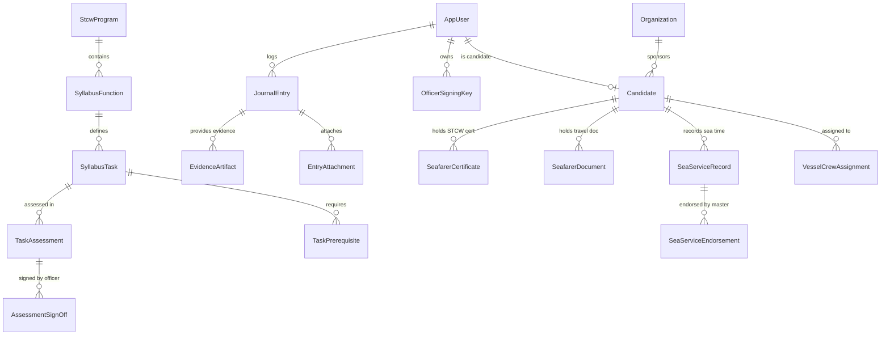
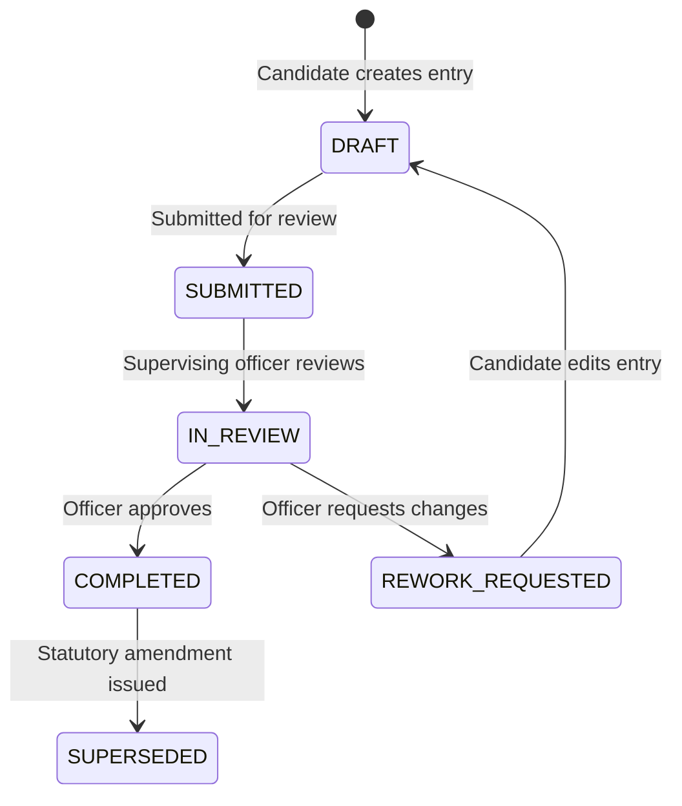
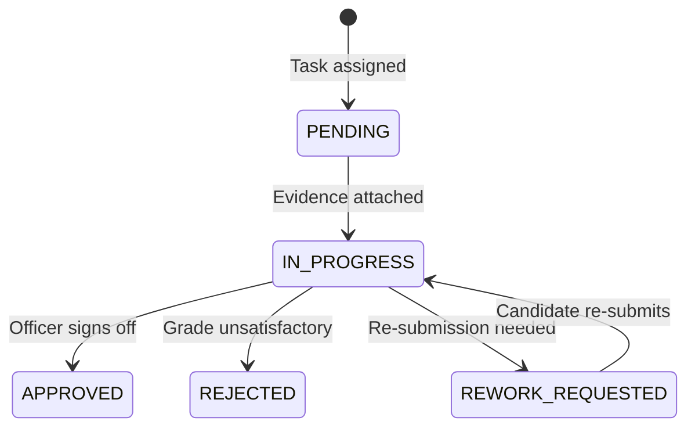

# Domain Model & STCW Invariants

The domain model of Project Tarbook encapsulates the operational realities of maritime cadet training under international statutory frameworks.

---

## ⚓ Key Domain Entities & Aggregates

---

## 📜 STCW Compliance & Domain Invariants

### 1. Sea Service Non-Overlapping Invariant
A seafarer cannot physically serve on two vessels simultaneously. Sea service records enforce non-overlapping date ranges per candidate using PostgreSQL GiST exclusion constraints (`uq_non_overlapping_sea_service`).

### 2. Statutory Officer Sign-Off & Hardware Provenance
All task sign-offs and master endorsements must be signed using ECDSA P-256 keys registered in `OfficerSigningKey`. Keys must be approved by the sponsoring organization before sign-offs are valid.

### 3. Hash Chaining for Audit Logs
Security and audit logs enforce append-only immutability through SHA-256 hash chaining (`prev_hash` -> `entry_hash`), preventing silent deletion or retrospective modification of logs.

### 4. Prerequisite Task Verification
A candidate cannot obtain final sign-off on advanced tasks until all prerequisite tasks (defined in `TaskPrerequisite`) are verified as completed.

---

## 🔄 Lifecycle State Machines

### Journal Entry State Machine

### Assessment Status State Machine

