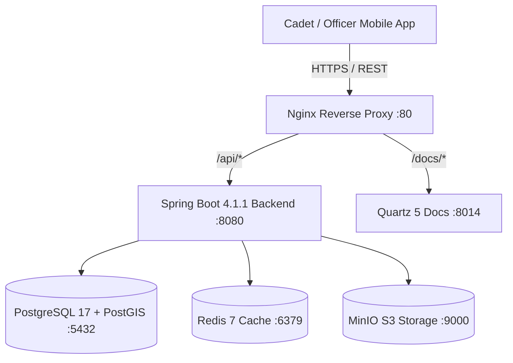

# System Architecture Overview

Project Tarbook is engineered as a **Spring Modulith** backend application deployed within a Docker-containerized runtime.

## C4 System Context

See also: [[architecture/bounded-contexts|Bounded Context Map]], [[architecture/domain-invariants|Domain Invariants]].
