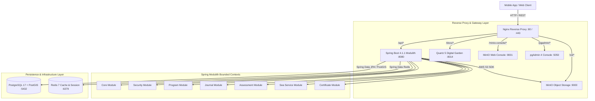

# System Topology & Modular Architecture

Project Tarbook is implemented as a **Spring Modulith** backend application with explicit bounded contexts, served through a containerized infrastructure stack.

---

## 🏛️ System Architecture Diagram

---

## 🧩 Spring Modulith Bounded Contexts

The backend is structured into 7 distinct Java packages under `com.mralmostcool.tarbook`, enforcing module boundary encapsulation:

| Bounded Context | Package | Primary Responsibility | Related Documentation |
| :--- | :--- | :--- | :--- |
| **Core** | `com.mralmostcool.tarbook.core` | Users, Organizations, Candidates, Vessel Crew Assignments | [[modules/core-module\|Core Module]] |
| **Security** | `com.mralmostcool.tarbook.security` | Officer ECDSA Keys, Hardware Attestation, Provenance | [[modules/security-module\|Security Module]] |
| **Program** | `com.mralmostcool.tarbook.program` | STCW Syllabi, Tasks, Prerequisites, Eligibility Rules | [[modules/program-module\|Program Module]] |
| **Journal** | `com.mralmostcool.tarbook.journal` | Sea Journal Entries, Attachments, Evidence, Audit Logs | [[modules/journal-module\|Journal Module]] |
| **Assessment** | `com.mralmostcool.tarbook.assessment` | Task Assessments, Multi-Tier Officer Sign-offs | [[modules/assessment-module\|Assessment Module]] |
| **SeaService** | `com.mralmostcool.tarbook.seaservice` | Voyage Logbooks, Master Endorsements, GiST Constraints | [[modules/seaservice-module\|SeaService Module]] |
| **Certificate** | `com.mralmostcool.tarbook.certificate` | Seafarer Travel Docs, STCW Modular Certificates | [[modules/certificate-module\|Certificate Module]] |

---

## 🧱 Key Architectural Principles

1. **Modulith Encapsulation**: Modules communicate via public service interfaces (e.g., `JournalService`, `SecurityService`) while internal domain entities and repositories remain package-private in `.internal.*`.
2. **Offline-First Resilience**: All operations support local queuing and idempotent sync protocols for satellite-connected ship environments.
3. **Statutory Non-Repudiation**: Officer sign-offs and master endorsements utilize ECDSA P-256 digital signatures with cryptographic hash chaining.
4. **Environment Isolation**: Strict separation between development (`dev`) and production (`prod`) configurations.
