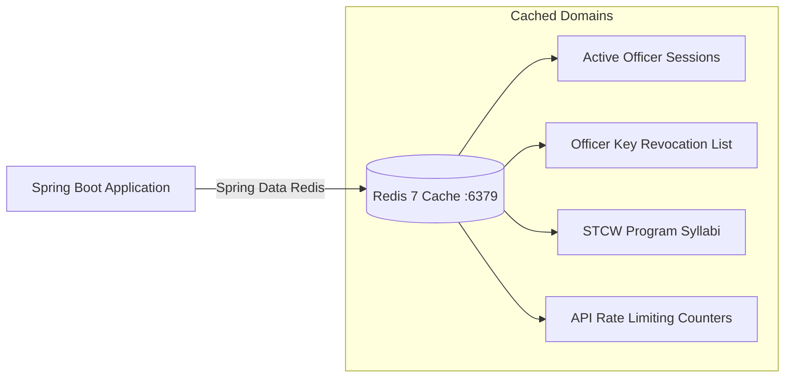

# Caching Strategy & MinIO Object Storage

Project Tarbook combines **Redis 7** for high-speed in-memory caching with **MinIO** for resilient S3-compatible binary evidence artifact storage.

---

## ⚡ Redis Caching Architecture

Redis is configured in `docker-compose.yml` (`storage-redis`) with persistent volume mounts (`./storage/redis/data`) and custom configuration ([redis.conf](file:///C:/Users/Neeraj%20Gupta/Projects/mralmostcool/tarbook-project/storage/redis/redis.conf)).



### Key Cache Namespaces & Expirations

1. **`officer_key_revocations`**: TTL: 24 Hours. Caches revoked ECDSA signing key IDs to ensure instant sign-off verification without querying PostgreSQL on every signature validation.
2. **`stcw_program_syllabi`**: TTL: 7 Days. Caches heavy syllabus trees (`StcwProgram` -> `SyllabusFunction` -> `SyllabusTask`).
3. **`cadet_active_session`**: TTL: 12 Hours. Caches cadet profile context during sea voyage log entries.

---

## 🪣 MinIO S3 Object Storage Topology

MinIO provides an S3-compatible API for storing evidence artifacts, scanned Certificates of Competency (CoC), and officer signature assets.

### S3 Bucket Layout

```text
minio-storage/
├── evidence-artifacts/
│   └── {cadet_id}/{year}/{journal_entry_id}/{artifact_id}.jpg
├── seafarer-documents/
│   └── {candidate_id}/docs/{document_id}.pdf
└── seafarer-certificates/
    └── {candidate_id}/certs/{certificate_id}.pdf
```

### Storage Security & Verification Invariants

* **SHA-256 Checksum Verification**: Every uploaded file is digested on the client and verified against `content_hash` / `sha256_checksum` in PostgreSQL before storage confirmation.
* **Pre-signed URLs**: Direct file downloads utilize temporary pre-signed S3 URLs (TTL: 15 minutes) generated by `MinioClient`, preventing public bucket exposures.
