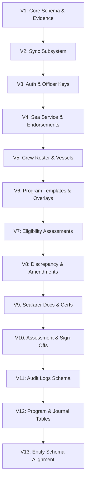

# Relational Schema & Flyway Migrations

Project Tarbook relies on **PostgreSQL 17** with the **PostGIS 3.5** extension for geospatial evidence capture and relational integrity.

---

## 🗄️ Database Schemas & Migrations Log

Schema evolutions are strictly managed using **Flyway**. All migrations are forward-only and version-controlled under `backend/src/main/resources/db/migration/`:



---

## 📜 Complete Flyway Migration Registry

| Migration Version | File Name | Primary Purpose & DDL Entities |
| :--- | :--- | :--- |
| **V1** | `V1__core_schema.sql` | `organizations`, `app_users`, `candidates`, `training_programs`, `task_definitions`, `tar_books`, `task_entries`, `task_signoffs`, `evidence_artifacts`. |
| **V2** | `V2__sync_subsystem.sql` | `global_sync_sequence` generator, `sync_queue` for low-bandwidth satellite sync. |
| **V3** | `V3__auth_and_integrity.sql` | `officer_signing_keys` (ECDSA P-256 registry), `audit_events`, key nonces in `task_signoffs`. |
| **V4** | `V4__sea_service_records.sql` | `sea_service_records`, `sea_service_endorsements`, GiST non-overlapping exclusion constraint `uq_non_overlapping_sea_service`. |
| **V5** | `V5__crew_roster_and_vessel_assignments.sql` | `vessel_crew_assignments` for shipboard assignment tracking. |
| **V6** | `V6__program_templates_and_overlays.sql` | Extends `training_programs` and `task_definitions` for multi-tenant company overlays. |
| **V7** | `V7__eligibility_assessments.sql` | `eligibility_assessments` table for automated STCW eligibility evaluator. |
| **V8** | `V8__discrepancy_and_amendment_model.sql` | `record_amendments` table, superseding record IDs for statutory corrections. |
| **V9** | `V9__seafarer_documents_and_certificates.sql` | `seafarer_documents`, `seafarer_certificates`, `document_verification_records`. |
| **V10** | `V10__assessment_and_signoff_schema.sql` | `task_assessments`, `assessment_signoffs` for competency workflow engine. |
| **V11** | `V11__audit_logs_schema.sql` | `audit_logs` table for hash-chained security audit logs. |
| **V12** | `V12__program_and_journal_persistence_schema.sql` | `stcw_programs`, `syllabus_functions`, `syllabus_tasks`, `task_prerequisites`, `cadet_eligibility_rules`, `journal_entries`, `entry_attachments`. |
| **V13** | `V13__align_entity_schemas.sql` | Schema alignment for `app_users`, `organizations`, `vessel_crew_assignments`, and `evidence_artifacts` JPA entities. |

---

## 🌍 PostGIS Spatial Data Integration

Evidence artifacts and journal entries store field location coordinates using PostGIS geometry primitives (`GEOMETRY(Point, 4326)`):

```sql
-- Spatial column definition in task_entries and evidence_artifacts
location GEOMETRY(Point, 4326),
gnss_accuracy_meters NUMERIC(6,2)
```

The `4326` spatial reference identifier (SRID) corresponds to WGS 84 GPS latitude/longitude coordinates captured directly from shipboard mobile devices.
