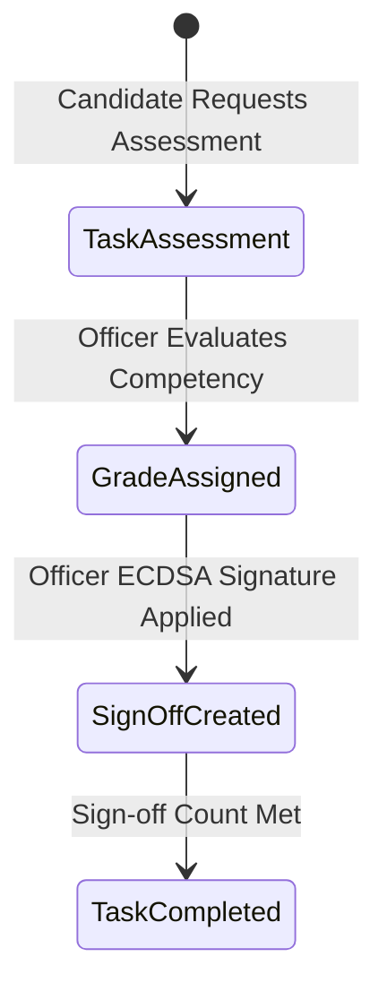

# Assessment & Officer Sign-off Module

The **Assessment Module** (`com.mralmostcool.tarbook.assessment`) manages candidate competency evaluations, grade assignments, and multi-tier officer sign-offs.

---

## ✍️ Assessment Workflow

---

## 🗄️ Entities & Tables

### 1. `TaskAssessment` (`task_assessments`)
Records competency evaluations for a specific `SyllabusTask`.
* **Grades**: `EXCELLENT`, `SATISFACTORY`, `NEEDS_IMPROVEMENT`, `NOT_YET_COMPETENT`.
* **Statuses**: `PENDING`, `IN_PROGRESS`, `APPROVED`, `REJECTED`, `REWORK_REQUESTED`.

### 2. `AssessmentSignOff` (`assessment_signoffs`)
Append-only officer sign-off record storing verdict, comments, and timestamp.
* **Roles**: `ASSESSOR`, `CHIEF_OFFICER`, `CHIEF_ENGINEER`, `MASTER`, `COMPANY_TRAINING_OFFICER`.
* **Verdicts**: `APPROVED`, `REJECTED`, `REWORK_REQUESTED`.
