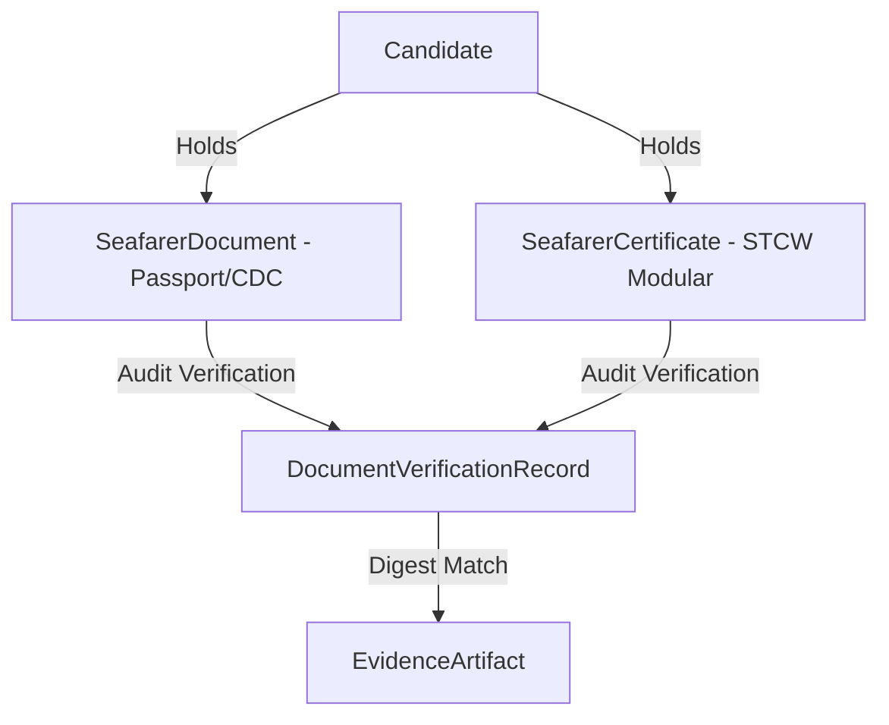

# Seafarer Documents & Certificates Module

The **Certificate Module** (`com.mralmostcool.tarbook.certificate`) manages seafarer travel documents (Passport, CDC, INDOS, SID), STCW modular safety certificates, and audit verification records.

---

## 📜 Document & Verification Model

---

## 🗄️ Entities & Tables

### 1. `SeafarerDocument` (`seafarer_documents`)
Travel documents (Passport, Continuous Discharge Certificate, INDOS, Seafarers Identity Document).

### 2. `SeafarerCertificate` (`seafarer_certificates`)
STCW safety certificates (PST, FPFF, EFA, PSSR, STSDSD, Medical Fitness).

### 3. `DocumentVerificationRecord` (`document_verification_records`)
Verifiable verification log recording audit decisions (`APPROVED`, `REJECTED`, `REVOKED`) with JSON Canonicalization Scheme (JCS) payloads.
