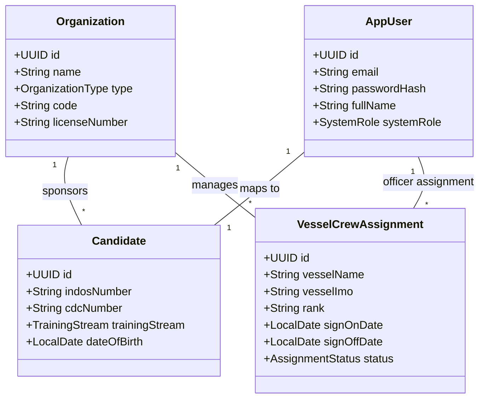

# Core Bounded Context

The **Core Bounded Context** (`com.mralmostcool.tarbook.core`) manages identity primitives, organization hierarchies, candidate profiles, and vessel crew assignments.

---

## 🏛️ Domain Entities & DDL Mapping



---

## 🔑 Key Entities & Functionality

### 1. `Organization`
Represents maritime training academies, shipping companies, flag state administrations, or classification societies.
* **Table**: `organizations`
* **Types**: `MARITIME_ACADEMY`, `SHIPPING_COMPANY`, `FLAG_STATE_ADMINISTRATION`, `CLASSIFICATION_SOCIETY`.

### 2. `AppUser`
System user entity supporting Spring Security authentication and RBAC.
* **Table**: `app_users`
* **Roles**: `DECK_CADET`, `ENGINE_CADET`, `SUPERVISING_OFFICER`, `CHIEF_ENGINEER`, `MASTER`, `COMPANY_TRAINING_OFFICER`, `ADMIN`.

### 3. `Candidate`
Extends `AppUser` for deck/engine cadets tracking Indian National Database of Seafarers (**INDOS**) and Continuous Discharge Certificate (**CDC**) numbers.
* **Table**: `candidates`

### 4. `VesselCrewAssignment`
Tracks seafarer shipboard postings and rank roles on active commercial vessels.
* **Table**: `vessel_crew_assignments`

---

## 💼 Core Service Interface (`CoreService`)

Public service interface exported by the Core module for cross-modulith operations:

```java
public interface CoreService {
    OrganizationDto createOrganization(CreateOrganizationRequest request);
    AppUserDto createUser(CreateUserRequest request);
    CandidateDto createCandidate(CreateCandidateRequest request);
    VesselCrewAssignmentDto assignCrewToVessel(CreateVesselAssignmentRequest request);
}
```
