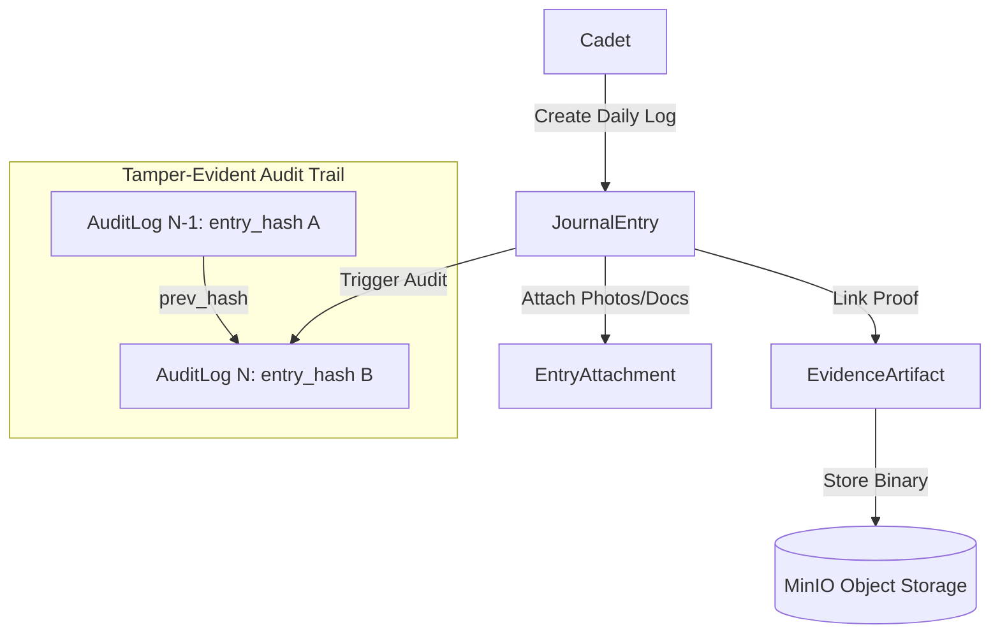

# Sea Journal & Evidence Subsystem

The **Journal Module** (`com.mralmostcool.tarbook.journal`) manages daily shipboard training logs, photo/document attachments, evidence artifacts, and hash-chained audit trails.

---

## 📷 Evidence Capture & Audit Log Architecture

---

## 🗄️ Domain Entities

### 1. `JournalEntry` (`journal_entries`)
Daily record of sea-time hours, watchkeeping activities, and candidate notes.

### 2. `EntryAttachment` (`entry_attachments`)
Uploaded support files (schematics, checklists, logs) linked to a journal entry.

### 3. `EvidenceArtifact` (`evidence_artifacts`)
Verifiable evidence artifact linked to an officer's signing key with SHA-256 `content_hash`.

### 4. `AuditLog` (`audit_logs`)
Immutable append-only security audit log enforcing SHA-256 hash chaining (`prev_hash` -> `entry_hash`).
