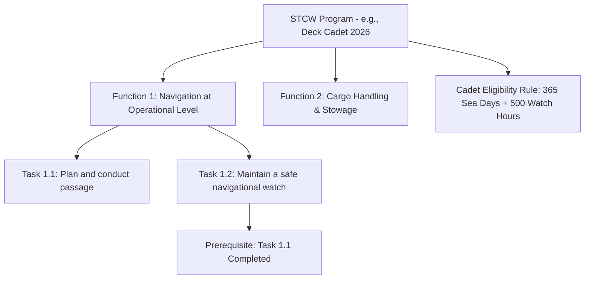

# STCW Program & Curriculum Module

The **Program Module** (`com.mralmostcool.tarbook.program`) manages STCW training curricula, multi-tier syllabus hierarchies, prerequisite task trees, and cadet eligibility rule definitions.

---

## 📚 Syllabus Taxonomy Hierarchy

---

## 🗄️ Entities & Tables

### 1. `StcwProgram` (`stcw_programs`)
Master training curriculum container for streams (`DECK_CADET`, `TRAINEE_ENGINE_OFFICER`, `TRAINEE_ETO`, `GP_RATING`).

### 2. `SyllabusFunction` (`syllabus_functions`)
Top-level STCW functional area (e.g., *Navigation*, *Marine Engineering*, *Electrical Systems*).

### 3. `SyllabusTask` (`syllabus_tasks`)
Individual competency task requirement defining `required_sign_offs` and `minimum_watchkeeping_hours`.

### 4. `TaskPrerequisite` (`task_prerequisites`)
Direct acyclic graph (DAG) enforcing prerequisite task dependencies before advanced tasks can be assessed.

### 5. `CadetEligibilityRule` (`cadet_eligibility_rules`)
Rules specifying minimum required sea days, bridge watchkeeping hours, and engine watchkeeping hours per stream.
