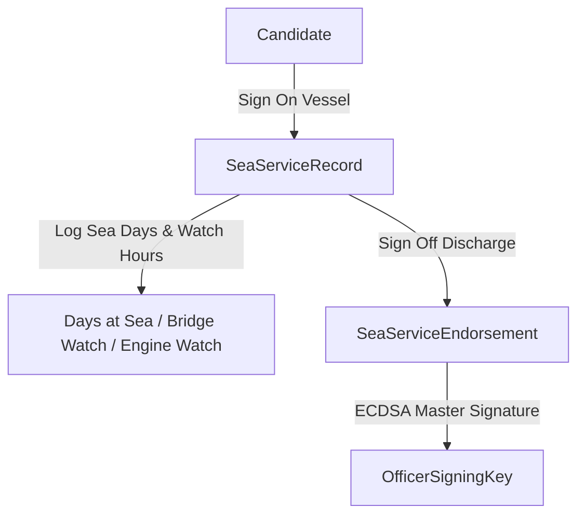

# Sea Service & Master Endorsement Module

The **Sea Service Module** (`com.mralmostcool.tarbook.seaservice`) tracks voyage logbooks, certified sea-time days, watchkeeping hours, and Master/Chief Engineer statutory discharge endorsements.

---

## ⚓ Voyage & Endorsement Structure

---

## 🗄️ Entities & GiST Constraint

### 1. `SeaServiceRecord` (`sea_service_records`)
Captures voyage details (vessel name, IMO, flag state, gross tonnage, sign-on/sign-off dates, days at sea, bridge and engine watchkeeping hours).

> [!IMPORTANT]
> Enforces non-overlapping voyage dates per candidate via PostgreSQL GiST exclusion constraint (`uq_non_overlapping_sea_service`).

### 2. `SeaServiceEndorsement` (`sea_service_endorsements`)
Statutory discharge endorsement signed by Master or Chief Engineer with nonces and signature bytes.
* **Endorsement Types**: `INTERIM_HANDOVER`, `FINAL_DISCHARGE`.
* **Ratings**: Conduct (`EXCELLENT`, `SATISFACTORY`, `UNSATISFACTORY`), Ability (`EXCELLENT`, `SATISFACTORY`, `UNSATISFACTORY`).
