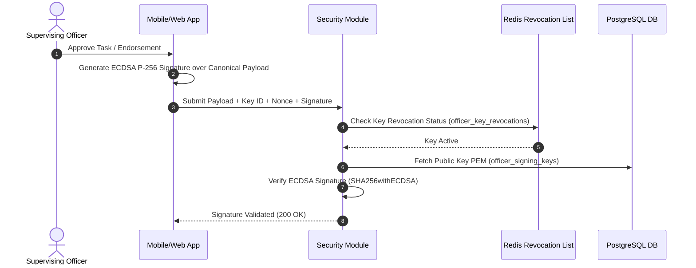

# Security & Cryptographic Provenance Module

The **Security Module** (`com.mralmostcool.tarbook.security`) provides cryptographic non-repudiation, hardware key registry, and statutory sign-off verification under [[architecture/adrs#adr-0004-ecdsa-p-256-officer-signing-keys|ADR 0004]].

---

## 🔒 Cryptographic Signing Architecture

---

## 🗝️ Key Entities & Structures

### `OfficerSigningKey`
Stores public keys for supervising officers, Chief Engineers, and Masters.
* **Table**: `officer_signing_keys`
* **Algorithm**: `ECDSA_P256`
* **Key Statuses**: `PENDING_APPROVAL`, `ACTIVE`, `REVOKED`, `EXPIRED`.
* **Hardware Backed**: Boolean flag indicating hardware enclave / WebAuthn origin.

---

## 📜 Key Security Invariants

1. **Non-Exportable Hardware Keys**: Private keys never leave the officer's mobile secure enclave / YubiKey. Only public key PEMs are transmitted.
2. **Replay Attack Prevention**: Every digital signature incorporates a unique, cryptographically random `signing_nonce` (UUID) and timestamp.
3. **Instant Revocation**: When an officer reports a lost device, `SecurityService.revokeKey(keyId, reason)` immediately writes to Redis (`officer_key_revocations`) to reject future sign-offs instantly.
