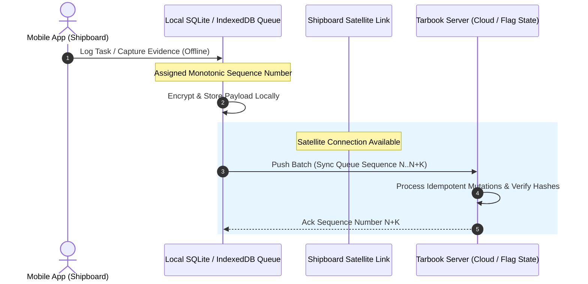

# Offline-First Architecture & Satellite Sync Protocol

Due to expensive, high-latency, intermittent satellite connectivity on commercial vessels, Project Tarbook operates on an **Offline-First Architecture**.

---

## 🛰️ Sync Queue & Transmission Workflow

---

## ⚡ Synchronization Guarantees & Conflict Rules

1. **Monotonic Sync Sequences**: Database records utilize `sync_sequence` (`global_sync_sequence` generator) for deterministic ordering.
2. **Idempotence**: All sync mutation requests supply client-generated UUIDs as primary keys, allowing safe retries without duplicate record creation.
3. **Conflict Resolution Policy**:
   - **Journal Entries & Sign-offs**: Append-only; no conflicts.
   - **Draft Edits**: Field-level Last-Write-Wins (LWW) based on candidate/supervisor timestamps.
   - **Sea Service Dates**: GiST exclusion constraint rejects overlapping dates at the DB level; requires explicit statutory amendment.
